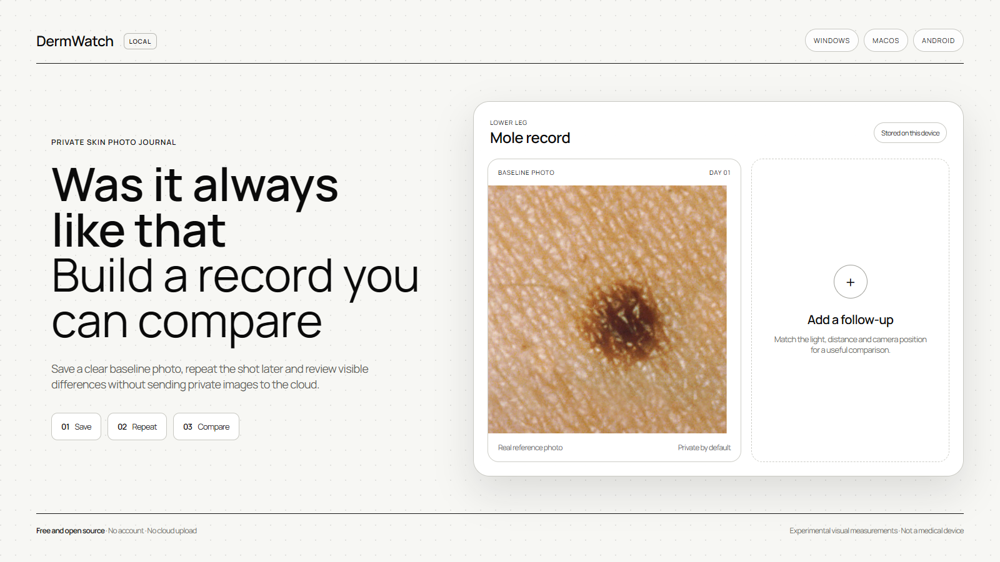

# Check moles for visual warning signs with DermWatch

DermWatch is a free local tool for a preliminary check of visual **ABCDE
warning signs associated with melanoma risk**. From one photo it measures
image-level asymmetry, border irregularity, color variation, and entered
diameter. Follow-up photos add the most important signal: visible change over
time. When its visual measurements are elevated, DermWatch recommends an
in-person check with a dermatologist.

Image analysis and photo storage stay on the user's device. No account or cloud
upload is required.

> [!IMPORTANT]
> **DermWatch identifies visual warning signs, not cancer.** It is not a medical
> device and does not calculate a clinically validated probability of cancer or
> personal risk score. It does not detect or rule out skin cancer or melanoma
> or confirm that a spot is benign. Diagnosis requires an in-person examination
> and, when needed, a biopsy. New, changing, different, itching, bleeding, or
> otherwise concerning spots should be assessed by a qualified clinician.



The demonstration photograph in the preview is a cropped public-domain image
from the [National Cancer Institute](https://commons.wikimedia.org/wiki/File:Normal_mole_(1).jpg).
It is included only to illustrate the photo-record workflow and is not a sample
diagnosis, risk estimate, or statement about an individual spot.

## Main purpose

DermWatch helps a person notice visual signs that can warrant a professional
skin-cancer check:

- **A — Asymmetry:** one side of the visible spot differs from the other;
- **B — Border:** the visible edge appears more irregular or poorly defined;
- **C — Color:** the photo contains uneven color or multiple shades;
- **D — Diameter:** the user records a ruler-based measurement when available;
- **E — Evolving:** later photos show a change in size, shape, or color.

The ABCDE rule describes warning signs of early melanoma according to the
[American Academy of Dermatology](https://www.aad.org/public/diseases/skin-cancer/abcdes-melanoma)
and the [National Cancer Institute](https://www.cancer.gov/types/skin/moles-fact-sheet#what-does-melanoma-look-like).
These signs are reasons to pay attention and seek medical review; they are not
a diagnosis or a numerical probability of cancer.

## Install

### Windows

1. Open the [latest release](https://github.com/amirmushichge/dermwatch/releases/latest).
2. Download `DermWatch-<version>-win-x64.exe`.
3. Double-click the installer. DermWatch opens automatically when installation
   finishes.

No Node.js, command line, account, cloud service, or separate database is
required. The installer contains everything the application needs.

Windows may display a SmartScreen warning until DermWatch has a trusted code-
signing certificate. If that happens, verify that the installer was downloaded
from this repository before proceeding.

### macOS

1. Open the [latest release](https://github.com/amirmushichge/dermwatch/releases/latest).
2. Download `DermWatch-<version>-mac-universal.dmg`.
3. Open the disk image and drag DermWatch into `Applications`.
4. Open DermWatch from `Applications`.

The universal build runs natively on both Apple Silicon and Intel Macs. No
Node.js, command line, account, cloud service, or separate database is required.

The current beta is not signed or notarized with an Apple Developer ID. macOS
may block the first launch. After attempting to open DermWatch, go to
`System Settings > Privacy & Security` and choose `Open Anyway` only if the file
was downloaded from this repository.

### Android

1. Open the [latest release](https://github.com/amirmushichge/dermwatch/releases/latest).
2. Download `app-release.apk` on the Android phone.
3. Open the file and allow installation from that browser or file manager when
   Android asks.

The APK contains the full application. It needs no Node.js, command line,
account, cloud service, or separate database. The APK is signed with the
project's stable release key, so later versions can be installed over it. It is
currently distributed directly from GitHub rather than Google Play.

## What it does

- performs a preliminary single-photo check of visible ABCDE warning signs
  associated with melanoma risk;
- explains which image-level signs are more pronounced and when an in-person
  dermatologist check is sensible;
- creates a separate record for each mole or skin spot;
- accepts one or several photos at once;
- checks sharpness, exposure, resolution, and segmentation confidence;
- measures visible asymmetry, border irregularity, color variation, and
  contrast using local image-processing heuristics;
- checks whether follow-up photos likely show the same spot;
- treats same-day photos as retakes rather than biological evolution;
- blocks change scores when focus, detection, scale, or framing make the
  photos insufficiently comparable;
- compares visible changes between observations;
- keeps a chronological photo history and reminder interval;
- exports and restores a private JSON backup containing records and photos;
- stores all records locally.

## Privacy

The desktop application binds its internal services to the loopback interface
only. Android uses app-private storage directly. Photos are not uploaded to
DermWatch, GitHub, or an external AI provider.

Records are stored under:

```text
Windows: %APPDATA%\DermWatch\data
macOS:   ~/Library/Application Support/DermWatch/data
Android: private app storage (not visible to other apps)
```

Desktop uninstall does not delete its data folder automatically. Android
uninstall removes its private records, so use **Backup > Export private backup**
before uninstalling or changing phones. Restore the JSON backup from the same
screen. The backup contains health photos and should be kept private. See
[PRIVACY.md](PRIVACY.md).

## How the analysis works

DermWatch is not an LLM and does not contain a pretrained medical classifier.
It uses deterministic browser image processing:

```text
photo -> quality gate -> spot segmentation -> ABCD visual measurements
      -> identity and capture checks -> E (evolution) -> guidance
```

The thresholds describe image features only. They are experimental, have not
been clinically validated, and must not be interpreted as a cancer probability
or proof that a spot is safe. See [DISCLAIMER.md](DISCLAIMER.md).

## Run from source

Requirements: Node.js 22.13 or newer.

```powershell
npm ci
npm run local-api
```

In a second terminal:

```powershell
npm run dev
```

Open `http://localhost:3000`.

## Build desktop installers

```powershell
npm ci
npm test
npm run desktop:build:windows
npm run desktop:smoke:packaged
```

On macOS, build the universal DMG with:

```bash
npm ci
npm test
npm run desktop:build:mac
npm run desktop:smoke:packaged
```

Installers are written to `release/`. GitHub Actions builds Windows, macOS, and
the signed Android APK when a version tag is pushed.

To sync and build an Android debug APK locally, install Android Studio with its
SDK and JDK, then run:

```bash
npm ci
npm run android:apk:debug
```

The APK is written to `android/app/build/outputs/apk/debug/app-debug.apk`.

## Development checks

```powershell
npm run lint
npm test
```

## License

Source code is available under the [MIT License](LICENSE).

## Credits and transparency

The current adaptation is by [Pulse](https://x.com/youraipulse) and
[Amir Mushich](https://x.com/AmirMushich). The project was inspired by
[OpenDerm](https://openderm.github.io/) by
[Marion Lepert](https://x.com/marionlepert), but does not redistribute OpenDerm
code, hardware files, datasets, or model weights.

DermWatch currently contains no pretrained ML model. Read
[Credits and provenance](CREDITS.md),
[Technical transparency](TECHNICAL_TRANSPARENCY.md), and
[Third-party notices](THIRD_PARTY_NOTICES.md).
